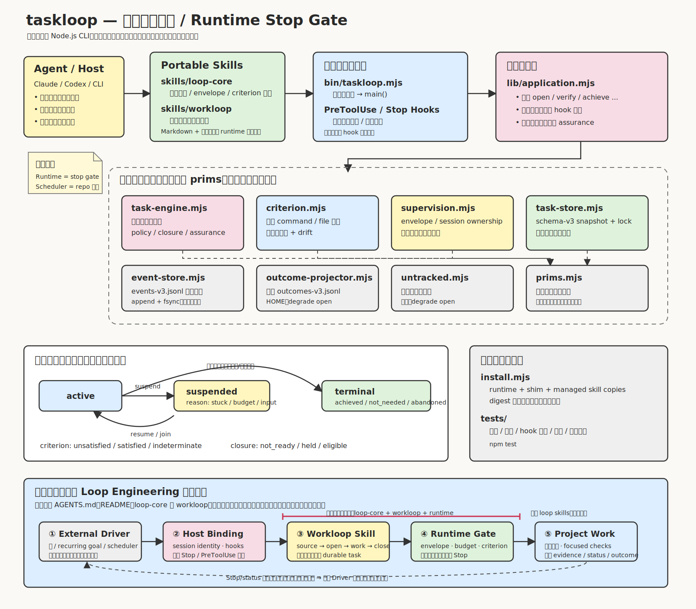
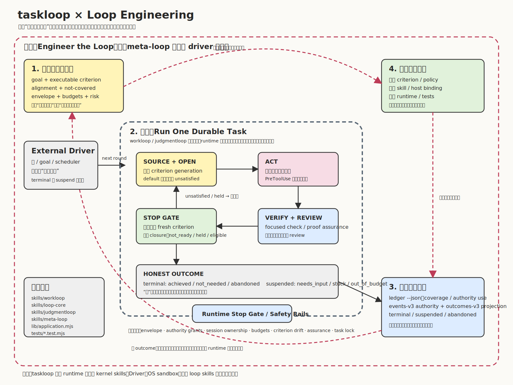

# taskloop

[中文说明](README.zh-CN.md)

taskloop is a dependency-free Node.js CLI and portable loop kernel for
machine-verifiable agent work. It supervises one durable task at a time: the
runtime constrains writes, re-runs a fresh done-when criterion, records
auditable evidence, and decides whether the task can close. Drivers,
schedulers, and OS sandboxes stay outside this repository.

This repository ships four kernel skills with the runtime:

- `skills/loop-core`: shared task, criterion, lifecycle, envelope, budget, and
  host-binding vocabulary.
- `skills/workloop`: machine-verifiable work from sourced criterion to honest
  terminal outcome.
- `skills/judgmentloop`: rubric and human-acceptance workflow for taste-based
  deliverables.
- `skills/meta-loop`: ledger-based review of how supervised loops converge,
  stall, suspend, or bypass supervision.

## Architecture





## Repository Map

- `bin/taskloop.mjs` is only the process entry.
- `lib/application.mjs` is the single assembly layer for CLI verbs, hook
  dispatch, event commits, snapshots, projection, and reports.
- Leaf modules in `lib/` may import only `lib/prims.mjs`; the architecture
  suite enforces that boundary.
- `lib/task-engine.mjs` owns lifecycle transitions, policy decisions, closure,
  assurance, budgets, stuck detection, and review requirements.
- `lib/event-store.mjs` owns hash-chained `.taskloop/events.jsonl`
  authority.
- `lib/task-store.mjs` owns the digest-checked schema-v3 snapshot wrapper and
  cross-process task lock.
- `lib/supervision.mjs`, `lib/host-hooks.mjs`, `lib/evidence-ledger.mjs`, and
  `lib/untracked.mjs` make hook-time write mediation, host protocol encoding,
  bounded telemetry, and no-task nudges explicit.
- `install.mjs` installs a versioned runtime, stable shims, and managed copies
  of the four skills under the current user's home.
- `tests/` covers behavior, architecture, hook protocol, runtime contract 5,
  event storage, snapshots, installer behavior, skill closure, and Windows
  gates.

## Core Model

Criterion observations are `unsatisfied`, `satisfied`, and `indeterminate`.
Task lifecycle is `active`, `suspended(reason)`, or `terminal(outcome)`, where
terminal outcomes are `achieved`, `not_needed`, and `abandoned`. Criterion
`satisfied` is evidence, not task completion; closure is separately projected
as `not_ready`, `held`, or `eligible`.

Three named policies define open, witness, and close behavior:

- `default`: open unsatisfied, require an unsatisfied witness, close
  automatically.
- `deferred-witness` (`deferred_witness` in state): open determinate, require a
  witness, close automatically.
- `steady-satisfied` (`steady_satisfied` in state): open determinate, no
  witness, close explicitly.

Every criterion definition has a stable `criterion_definition_hash` and a
non-reusable `criterion_generation_id`. Criterion or policy amendments create a
new generation; old witnesses and reviews do not carry across it.

## Basic Use

```sh
node bin/taskloop.mjs open --repo . --goal "observable outcome" \
  --criterion "npm test" --criterion-policy default \
  --alignment-because "the suite exercises the requested behavior" \
  --not-covered "deployed environment" \
  --files "lib/**" --files "tests/**"

node bin/taskloop.mjs status --repo .
node bin/taskloop.mjs verify --repo .
node bin/taskloop.mjs achieve --repo .
```

Prefer a repository-relative criterion file for portable work:

```sh
taskloop open --repo . --goal "observable outcome" \
  --criterion-file "acceptance.mjs" \
  --criterion-protocol tri-state \
  --criterion-policy default \
  --alignment-because "the adapter checks the requested behavior" \
  --not-covered "external deployment" \
  --files "lib/**" --files "tests/**"
```

Tri-state adapters use protocol version 2: exit `4` means `satisfied`, `3`
means `unsatisfied`, and `2` means `indeterminate`. Exit `0` is treated as
silent/indeterminate, so old 0/1 adapters must be updated before use.

Other lifecycle verbs:

```sh
taskloop suspend --repo . --reason needs-input --remaining "credential" \
  --failure "cannot authenticate" --next-action "provide test access"
taskloop resume --repo . --reason "access supplied"
taskloop join --repo . --reason "continue this active task in this session"
taskloop not-needed --repo . --evidence "read-only probe showed the goal already holds"
taskloop abandon --repo . --reason "superseded"
```

## Runtime Authority

Runtime contract 5 uses `.taskloop/events.jsonl` as the only repository
authority. `.taskloop/task.json` is a schema-v3 snapshot wrapper that may be
deleted and rebuilt from events; it is never promoted to authority. Every
public mutation commits one hash-chained transaction before refreshing the
snapshot.

`~/.taskloop/outcomes.jsonl` is a best-effort HOME projection, not task
authority. Rebuild it idempotently with:

```sh
taskloop sync-outcomes --repo .
taskloop audit --repo .
taskloop audit-outcomes
```

Runtime contract 5 removes schema versions from active artifact names while
leaving the versions inside their JSON/JSONL content unchanged. If a repository
still has legacy versioned artifact names, normal commands fail closed until the
user authorizes the one-time rename:

```sh
taskloop migrate-artifact-names --repo . \
  --reason "adopt stable artifact names" --granted-by user
```

If an older projection already occupies `outcomes.jsonl`, migration preserves
its exact bytes under `~/.taskloop/archive/` before promoting the current
projection. Two current-schema projections remain an explicit conflict.

Schema-2 tasks and orphan/mixed snapshots fail closed. Preserve incompatible
state byte-for-byte only with explicit user provenance:

```sh
taskloop archive-incompatible-state --repo . \
  --reason "runtime-contract-5 hard cutover" --granted-by user
```

`taskloop info` exposes the active versions:

- `runtime_contract: 5`
- `criterion_adapter_protocol_version: 2`
- `task_snapshot_schema_version: 3`
- `event_record_schema_version: 2`
- `outcome_projection_schema_version: 3`

## Budgets and Safety

Rounds are bounded by default. Optional write, wall-clock, and output-token
budgets add independent bounds. Exhausting any configured budget denies further
writes while reads and verification remain available. A fresh unsatisfied Stop
or explicit `achieve` suspends as `out_of_budget`; a fresh satisfied criterion
can still close the task. Repeated equivalent failures suspend as `stuck`.

Command safety is deny-by-default. Git mutations and authority expansions are
explicit grants with provenance:

```sh
taskloop amend --repo . --git-allowed add \
  --git-reason "prepare the user-requested commit" \
  --granted-by user --reason "user requested staging"
```

Network, destructive, install-script, and publish-shaped commands require
their matching grants. Remote download-to-shell execution requires both
network and destructive grants. Secret dumps remain denied.

## Hooks and Hosts

Hook recipes require an explicit profile:

```sh
taskloop hooks --profile codex-safe --mode nudge
taskloop hooks --profile claude --mode nudge
```

`codex-safe` preserves PreToolUse deny/rewrite behavior but releases a held
Stop with zero stdout and an explanatory stderr warning; continue through an
external driver or run `taskloop achieve` explicitly. `claude` preserves Claude
Code's session-internal `decision:block` continuation. `codex-cli-legacy` is
only a version-pinned experiment and must not be used in Codex App.

The latest episode owns Stop adjudication and the write envelope when its
`host_session_id` is bound. Foreign sessions read and verify freely, but cannot
write the envelope or task/git control state; use `join --reason` to transfer
an active task or a separate worktree for parallel work.

## Assurance and Review

Proof assurance and change assurance are separate. A criterion or policy
amended after an artifact write creates `criterion_assurance_gap`; strengthen
and re-witness the proof, or explicitly record a provisional downgrade with
`accept-proof-gap`.

Change review is driven by declared risk plus machine floors. `routine` risk
needs no review by default, `substantial` requires `fresh-context`, and
`critical` requires `second-model`. Use `--review-policy required|waived` for
an explicit override; every waiver requires a reason and remains audited.

```sh
taskloop review --repo . --level fresh-context --reviewer peer \
  --blocking-findings 0 --advisory-findings 0
```

Machine floors price only authority use observed by an active PreToolUse hook.
Unused grants and absent sensors do not fabricate use. When the bounded
evidence stream is corrupt, gapped, or truncated, `ledger --json` reports
unknowns instead of converting missing history into clean negatives.

## Install and Verify

```sh
node install.mjs
npm test
npm run bench:event-store -- --json
node bin/taskloop.mjs help
```

Use `TASKLOOP_INSTALL_HOME` for manual install tests. The installer preserves
unowned, locally modified, symlinked, or externally taken-over skill trees and
deduplicates aliased Claude/Codex roots. It reads user-level Codex Hook
configuration only to warn about legacy taskloop Stop commands; it does not
rewrite Hook configuration unless `--configure-codex` is explicitly supplied,
and that flag is limited to the outcome-projection writable root.

The Windows release gate runs W01-W08 on Windows 2022/2025 with Node 22/24.
See [loop-core reference](skills/loop-core/REFERENCE.md),
[host binding recipes](skills/loop-core/HOSTS.md), and
[adapter contract](skills/loop-core/ADAPTERS.md) for the full contract.
