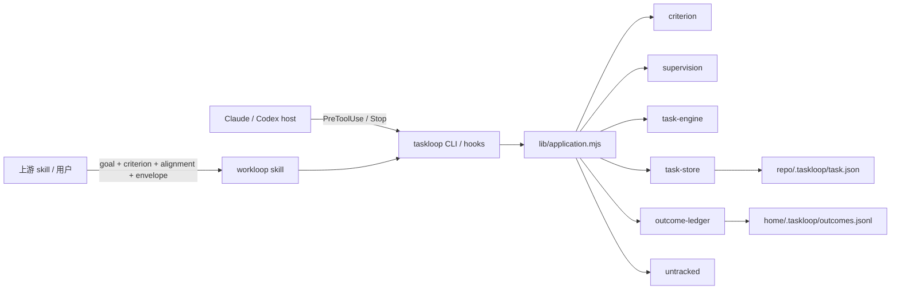

# taskloop

taskloop 是一个面向编码 agent 的 task-first 循环内核。它只提供两层能力：

- **机器停机门**：CLI、PreToolUse/Stop hook 协议、写入 envelope、判据闸门、
  task/episode 状态机与 outcome ledger。
- **通用 workloop**：把任意上游 skill 交付的目标和机器判据运行到明确终态。

taskloop 不内置 planner、测试框架、报告格式、评审流程或调度器，也不按 skill 名称
做路由。各种 skills 通过一个稳定的数据 seam 与它组合。

## 组合协议

任意 skill、工具或用户都可以向 `workloop` 交付相同字段：

```text
goal             一个可观察结果
criterion        一条可执行判据；或使用 criterion-file
alignment        green 为什么能证明 goal，以及未覆盖什么
files            允许写入的 envelope，可重复传入
evidence?        可选的失败项、freshness、resume snapshot 等上下文
```

`workloop` 只验证并消费这些字段，不要求知道生产者是谁。外部证据需要解析时，证据
生产者或消费项目提供只读 criterion adapter，并在 open 时声明
`--criterion-protocol tri-state`；taskloop 只规定 `0=通过、1=失败、2=无法裁决`
的接口，不附带格式专用 adapter。普通测试命令默认使用 `binary`，其 exit 2 仍是失败。

这意味着 planner、调试、单测、端到端测试、代码评审或未来的新 skill 都能独立演进，
而不需要修改 taskloop。

## 仓库内容

| 路径 | 所有权 |
| --- | --- |
| `bin/taskloop.mjs` | 稳定源码入口，只组装 `lib/application.mjs` |
| `lib/` | 判据、监督、状态机、持久化、ledger 与 telemetry |
| `skills/workloop/` | 唯一可触发的核心 loop skill |
| `skills/loop-core/` | 共享 task 语义与 adapter 接口，不可直接触发 |
| `install.mjs` | 版本化 runtime 与核心 skills 的用户级安装器 |
| `tests/` | CLI/hook、架构、并发安装与 core-only 组合契约 |

运行时和安装器只使用 Node.js built-ins，没有第三方运行时依赖。

## 架构



运行时采用一个装配层加若干叶子模块的结构：

- `bin/taskloop.mjs` 是稳定进程入口，只导入 `lib/application.mjs`；后者负责 CLI
  动词、hook 协议和各模块的编排。
- `criterion` 运行 binary/tri-state 判据并维护输入指纹；`supervision` 识别写形
  调用、命令风险和 envelope；`untracked` 在没有 open task 时处理多文件写入提示。
- `task-engine` 是生命周期状态的唯一所有者，以纯 transition 处理 episode、预算、
  suspension、attempt、review 和终态；`task-store` 负责原子状态写与跨进程串行化。
- `outcome-ledger` 把 open、暂停/恢复和终态投影到用户级 JSONL。task 状态是关单
  裁决依据，ledger 是可降级的审计遥测，两者故障语义不同。
- 叶子模块只能依赖 `prims`，不能横向导入；这个方向和 hook 公共输出都由架构测试
  固定，避免状态规则或宿主协议散落到多个模块。

一次 task 的主链路是：

1. `open` 校验组合字段、运行出生判据、建立 task 与写入 envelope。
2. `PreToolUse` 在写调用前检查命令安全、授权、预算和目标路径，通过后记录写入证据；
   读和验证不消耗写预算。
3. `Stop` 或 `done` 重新运行判据，并依次裁决输入漂移、earn-red 目击和弱判据评审；
   红态反馈下一轮，重复失败或预算耗尽转为 sticky suspension，fresh green 才能 `done`。
4. 终态或暂停写回 `.taskloop/task.json`，并尽力追加 outcome ledger。下一轮由宿主
   driver、人或外部 scheduler 触发，taskloop 本身不负责调度。

安装路径与运行路径分离：`install.mjs` 把 `bin/` 和 `lib/` 复制到内容哈希 runtime，
最后原子切换稳定 shim，同时以内容摘要管理 Claude/Codex 的 `workloop` 与
`loop-core` 副本。

## 安装

```bash
git clone https://github.com/hex1n/taskloop.git
cd taskloop
node install.mjs
```

安装器写入：

```text
~/bin/taskloop.mjs                         稳定 import shim
~/bin/.taskloop-runtime/<content-hash>/   固定版本的 bin/lib runtime
~/bin/.taskloop-managed-skills.json       每个 runtime 的受管 skill 内容摘要
~/.claude/skills/workloop/                Claude Code skill 副本
~/.claude/skills/loop-core/               Claude Code 支持材料
~/.codex/skills/workloop/                 Codex skill 副本
~/.codex/skills/loop-core/                Codex 支持材料
```

runtime 先复制到内容哈希目录，再原子切换稳定 shim；skill 以完整目录替换。所有
runtime/skill 的 copy、activate、prune 由同一把 owner-token 跨进程锁串行化。
安装器用逐 runtime 内容摘要证明所有权：只更新或删除仍与上次安装摘要一致的目录；
同名但未受管、被本地修改或已由其他仓库接管的 skill 会被保留并报错/释放所有权。
Claude 与 Codex 指向同一 skills 根目录时只安装一次，但两个 runtime 都记录 provenance。

Codex 的默认 `workspace-write` 不包含用户级 outcome ledger 目录。安装器会检测
`~/.codex/config.toml`：缺少绑定时只告警，不会静默接管用户配置。显式授权后可安全、
幂等地把 `~/.taskloop` 合并进已有 `writable_roots`：

```bash
node install.mjs --configure-codex
```

该选项保留已有字段、注释和其他 roots；无法安全解析或配置文件是 symlink 时拒绝写入，
此时使用 `codex --add-dir ~/.taskloop` 或手动编辑其真实所有者。新配置从下一次 Codex
会话开始生效。

查看漂移而不写入：

```bash
node install.mjs --dry-run
```

`--dry-run --configure-codex` 会同时预览 runtime、skills 和 Codex binding，仍不写文件。

打印 Claude Code 与 Codex 的手动 hook 配置：

```bash
node ~/bin/taskloop.mjs hooks
```

## 第一个任务

```bash
node ~/bin/taskloop.mjs open --repo . \
  --goal "实现一个可观察结果" \
  --criterion "node --test tests/feature.test.mjs" \
  --alignment "green ⇒ goal because 测试覆盖目标行为; not covered: 部署环境" \
  --files "src/**" \
  --files "tests/**"
```

判据是仓库脚本时使用 `--criterion-file <repo-relative-path>`，使 taskloop 能直接
记录脚本指纹。每个 envelope glob 单独传一个 `--files`。

常用只读命令：

```bash
node ~/bin/taskloop.mjs status --repo .
node ~/bin/taskloop.mjs verify --repo .
node ~/bin/taskloop.mjs info
```

## Task 模型

`.taskloop/task.json` 是目标仓库内 gitignored 的当前 task 状态：

```text
Task
├── goal + criterion/criterion_file + alignment
├── envelope(files/git/destructive/network)
├── budget(rounds/writes/wall-clock/tokens) + spent
├── evidence + attempts + reviews
├── suspension?
└── episodes[]
```

- 预算属于 Task；换 session、开新 Episode 或 resume 都不会补充预算。
- 读和验证始终自由；envelope 与 suspension 只约束写形调用。
- `suspend` 保持 Task 为 open；阻塞变化后显式 `resume --reason`。
- `done` 现场重跑判据，只有 fresh green 能关闭任务。
- open、suspend/resume 和终态追加到 `~/.taskloop/outcomes.jsonl`。

## 模块方向与担保边界

`bin/taskloop.mjs` 只导入 `lib/application.mjs`。叶子模块只能依赖 `prims`，不能
彼此横向导入；生命周期状态变化归 `task-engine`。这个方向由架构测试约束。

taskloop 是协作式 guardrail，不是 sandbox。它的硬担保是：

> 在环境健康且状态文件未被直接篡改时，红判据不能把 Task 收成 `done`。

它不防刻意修改 `.taskloop/task.json`、自我放行的判据或 shell 间接绕过。

## 开发与验证

```bash
npm test
node bin/taskloop.mjs help
node install.mjs --dry-run
```

CI 在 macOS、Linux、Windows 上使用 Node 22 和 Node 24 运行相同测试。
