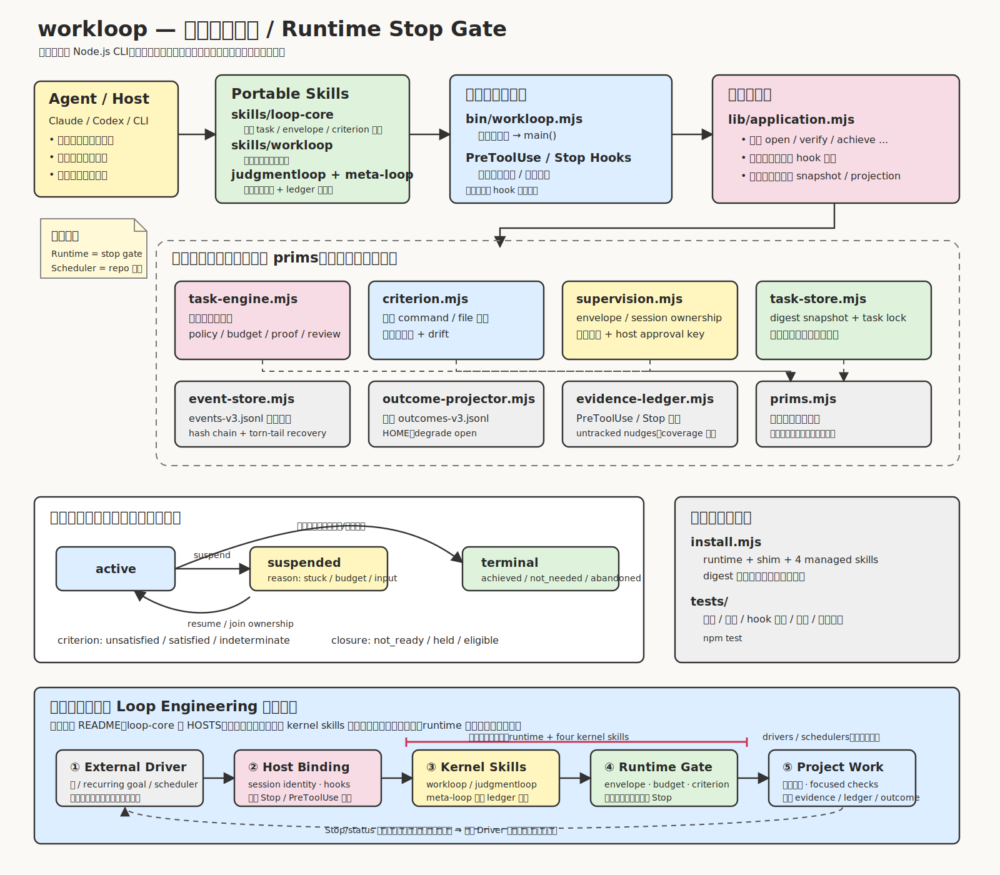
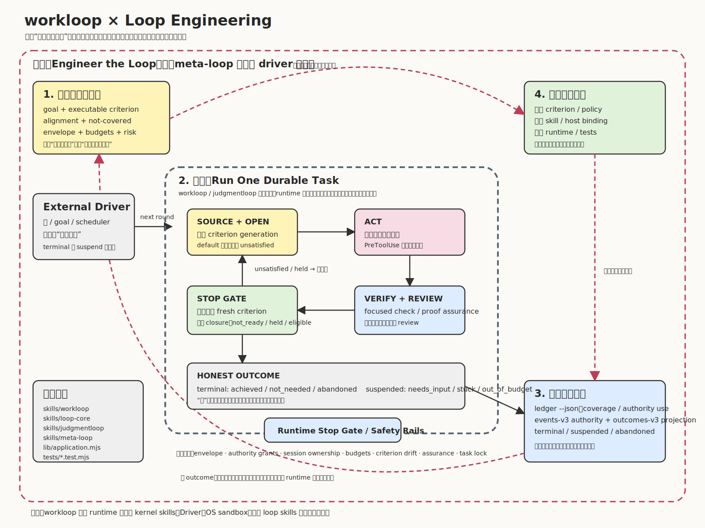

# workloop

[English README](README.md)

workloop 是一个零依赖 Node.js CLI，也是面向 coding agent 的可移植循环内核。它一次监督一个 durable task：宿主独占工具执行与审批权，运行时记录操作意图和完成回执、核对真正落地的 artifact、重新执行新鲜的 done-when 判据，并认证任务是否可以关闭。下一轮调度、宿主权限系统和 OS 级 sandbox 不在本仓库内。

本仓库随 runtime 一起发布四个 kernel skills。旗舰 skill 与仓库同名，就像 `webpack` 同时是项目名和核心包名：`workloop` 这个 CLI 监督 task，`skills/workloop` 是跑在它上面的循环。

- `skills/loop-core`：共享 task、criterion、lifecycle、envelope、budget 和 host binding 词汇。
- `skills/workloop`：从已来源化判据到诚实终态的机器可验证工作闭环。
- `skills/judgmentloop`：面向文案、设计、命名等品味型交付物的 rubric 与人工验收闭环。
- `skills/meta-loop`：基于 ledger 复盘循环是否收敛、停滞、挂起或绕过监督。

## 架构图





## 仓库结构

- `bin/workloop.mjs` 只是进程入口。
- `lib/application.mjs` 是唯一装配层，负责 CLI verb、hook dispatch、事件提交、snapshot、projection 和 report。
- `lib/` 下叶子模块只能导入 `lib/prims.mjs`，架构测试会强制这个边界。
- `lib/task-engine.mjs` 拥有生命周期转移、策略决策、closure、assurance、budget、stuck 检测和 review requirement。
- `lib/event-store.mjs` 拥有 hash-chained `.workloop/events.jsonl` 权威日志。
- `lib/task-store.mjs` 拥有 digest 校验的 schema-v3 snapshot wrapper 和跨进程 task lock。
- `lib/supervision.mjs`、`lib/host-hooks.mjs`、`lib/evidence-ledger.mjs`、`lib/untracked.mjs` 分别承载 hook policy 分类、宿主协议编码、有界证据遥测和无任务写入提示。
- `install.mjs` 在当前用户 home 下安装版本化 runtime、稳定 shim 和四个 managed skills。
- `tests/` 覆盖行为、架构、hook 协议、runtime contract 5–7、事件存储、snapshot、installer、skill closure 和 Windows gates。

## 核心模型

Criterion observation 只有三种：`unsatisfied`、`satisfied`、`indeterminate`。Task lifecycle 是 `active`、`suspended(reason)` 或 `terminal(outcome)`，其中终态 outcome 是 `achieved`、`not_needed`、`abandoned`。Criterion `satisfied` 只是证据，不等于任务完成；closure 另行投影为 `not_ready`、`held` 或 `eligible`。

三个具名 policy 定义 open、witness 和 close 行为：

- `default`：以 unsatisfied 打开，需要 unsatisfied witness，自动关闭。
- `deferred-witness`（状态中为 `deferred_witness`）：以 determinate 打开，需要 witness，自动关闭。
- `steady-satisfied`（状态中为 `steady_satisfied`）：以 determinate 打开，不需要 witness，显式关闭。

每个 criterion definition 都有稳定的 `criterion_definition_hash` 和不可复用的 `criterion_generation_id`。修改 criterion 或 policy 会创建新 generation，旧 witness 和 review 不跨 generation 继承。

## 基本使用

```sh
node bin/workloop.mjs open --repo . --goal "observable outcome" \
  --criterion "npm test" --criterion-policy default \
  --alignment-because "the suite exercises the requested behavior" \
  --not-covered "deployed environment" \
  --files "lib/**" --files "tests/**"

node bin/workloop.mjs status --repo .
node bin/workloop.mjs verify --repo .
node bin/workloop.mjs achieve --repo .
```

可移植工作优先使用仓库相对的 criterion 文件：

```sh
workloop open --repo . --goal "observable outcome" \
  --criterion-file "acceptance.mjs" \
  --criterion-protocol tri-state \
  --criterion-policy default \
  --alignment-because "the adapter checks the requested behavior" \
  --not-covered "external deployment" \
  --files "lib/**" --files "tests/**"
```

Tri-state adapter 使用 protocol version 2：退出码 `4` 表示 `satisfied`，`3` 表示 `unsatisfied`，`2` 表示 `indeterminate`。退出码 `0` 会被当作 silent/indeterminate，所以旧的 0/1 adapter 必须先升级。

其他生命周期命令：

```sh
workloop suspend --repo . --reason needs-input --remaining "credential" \
  --failure "cannot authenticate" --next-action "provide test access"
workloop resume --repo . --reason "access supplied"
workloop join --repo . --reason "continue this active task in this session"
workloop not-needed --repo . --evidence "read-only probe showed the goal already holds"
workloop abandon --repo . --reason "superseded"
```

## 运行时权威

Runtime contract 7 把 `.workloop/events.jsonl` 作为仓库内唯一权威。`.workloop/task.json` 是 schema-v3 snapshot wrapper，可以删除并从事件重建，永远不会被提升为权威。Contract 7 projection 使用 persisted task runtime contract 6；event record framing 仍是 schema 2。每个公开 mutation 都先提交一条 hash-chained transaction，再刷新 snapshot。

执行权只属于宿主。PreToolUse 写入 `operation_intent_recorded` 和 policy deviation，不再声称 Workloop 授权了操作；PostToolUse/PostToolUseFailure 记录相关联的完成回执，仓库 checkpoint reconciliation 记录真正落地的 artifact 变化，coverage 则说明未知范围。意图数量永远不会伪报成 artifact mutation。

`~/.workloop/outcomes.jsonl` 是 home 下的 best-effort projection，不是 task authority。可以幂等重建和审计：

```sh
workloop sync-outcomes --repo .
workloop audit --repo .
workloop audit-outcomes
```

Contract 5 已经移除了活动产物文件名中的 schema 版本；Contract 7 继续使用稳定文件名。如果仓库仍使用更旧的带版本文件名，普通命令会 fail closed，直到用户显式授权一次性改名：

```sh
workloop migrate-artifact-names --repo . \
  --reason "adopt stable artifact names" --granted-by user
```

如果旧格式投影已经占用了 `outcomes.jsonl`，迁移会先把原始字节保存在 `~/.workloop/archive/`，再提升当前投影；如果两边都是当前 schema，则仍按冲突处理，不会自动覆盖。

Schema-2 task 和 orphan/mixed snapshot 都 fail closed。只有带显式 user provenance 时才保留 incompatible state 的原始字节：

```sh
workloop archive-incompatible-state --repo . \
  --reason "runtime-contract-7 hard cutover" --granted-by user
```

`workloop info` 暴露当前版本：

- `runtime_contract: 7`
- `criterion_adapter_protocol_version: 2`
- `task_snapshot_schema_version: 3`
- `event_record_schema_version: 2`
- `outcome_projection_schema_version: 5`

## Budget 与安全

Round 默认有上限。Intent、wall-clock 和 output-token budget 是独立的终态认证上限。在默认 `nudge` recipe 下，超预算意图仍交给宿主审批，只记录 deviation；closure 会被 hold，unsatisfied 的显式 adjudication 会以 `out_of_budget` 挂起。重复等价失败会以 `stuck` 挂起。

Git、network、destructive、install、publish 和 command-safety finding 都是带 provenance 的 task policy。在 `observe`/`nudge` 下，它们只影响证据、风险、review 和终态认证，不覆盖宿主审批。只有显式安装 `--mode deny` 才把这些 finding 变成执行拒绝：

省略 `--mode` 等价于 `nudge`，不会隐式进入强制模式。Contract 7 还会把未知 MCP action 保守地视为可能具有副作用的 operation，从而为远端变更关联 Pre/Post 回执；以 `get`、`list`、`read`、`search` 等明确读取动词开头的 MCP tool 不计入 operation budget。

```sh
workloop amend --repo . --git-allowed add \
  --git-reason "prepare the user-requested commit" \
  --granted-by user --reason "user requested staging"
```

Network、destructive、install-script 和 publish-shaped command 需要对应 grant 才能得到干净认证。远程下载后直接 pipe 到 shell 需要同时具备 network 和 destructive grant。Secret dump 始终是 policy deviation；显式强制模式会拒绝它。

这个分类器读的是命令形状而非意图，覆盖面比上述类名听起来要窄。Network 指 `curl`、`wget`、`Invoke-WebRequest`；secret dump 指常见读取工具读取已知凭据路径。其他出口（`git clone`、`ssh`、`scp`）、读取同一批文件的其他工具，以及任何通过 shell 变量拼装工具名的命令，都可能无法识别。请把它当作证据与风险分类器：真正的安全边界仍然是宿主权限系统与操作系统沙箱。

结构化命令解析会为每个可执行视图只生成一次带宿主方言的中间结构：chain separator、invocation、嵌套命令体与 ambiguity 都在这里确定，git 授权、owner 安全检查、风险形状和 foreign-session 检查再从同一结构投影效果。已知选项按精确语法解析；已知工具或 wrapper 上的未知选项会同时按 boolean 和 value-taking 两种合法情况解析，结果标为 ambiguous，并保留所有可能的危险效果。嵌套的 `cmd`、PowerShell 与 POSIX shell 命令体会切换到各自方言；闭合 heredoc 会成为嵌套输入结构。无法静态还原、且不是已识别远程来源的解释器 stdin，以及 CMD `FOR /F` substitution，统一归类为 `dynamic_exec` 并拒绝；已识别的远程 pipe 仍使用可单独授权的 `remote_exec`。完全未识别的 wrapper，以及通过 shell 变量拼装的工具名，仍不在这个结构模型内。

## Hooks 与宿主

Hook recipe 必须显式指定 profile：

```sh
workloop hooks --profile codex-safe --mode nudge
workloop hooks --profile claude --mode nudge
```

生成的 recipe 默认使用 `nudge`：Pre 记录意图与 deviation，Post 记录回执，Stop 记录 census；三者故障时都 fail open，不返回执行拒绝或完成阻塞。`observe` 是静默版本。`deny` 是显式强制模式：Pre 可以返回宿主 deny，Claude profile 可以使用 `decision:block`；Codex profile 的 Stop 仍是 release-only。Workloop 命令改写仍可返回 `updatedInput`，但非强制响应不携带 `permissionDecision`，审批权继续留在宿主。

所有 criterion 都在独立 single-flight lease 下、`.workloop/.task.lock` 之外执行。事务令牌绑定 intent、task/source cursor/revision/generation/owner episode，并用包含 ignored files、排除 `.git`/`.workloop` 的完整仓库内容指纹兜底。运行前后任一权威或内容发生变化时，旧 observation 以 `criterion_observation_stale` 丢弃，不计 round、不关闭任务；已识别的内容变化仍记录 side-effect evidence，使 artifact revision 推进并让旧 review 过期。PreToolUse、status 和 suspend 仍可立即取得 task lock。Runtime 的 Stop deadline 小于生成 recipe 的 timeout，Host timeout 只是第二道回收保险。

最新 episode 在其 `host_session_id` 被绑定时拥有 Stop adjudication 和 write envelope。Foreign session 可以自由读取和验证，但不能写 envelope 或 task/git control state；继续 active task 用 `join --reason` 转移所有权，并行工作用单独 worktree。

## Assurance 与 Review

Proof assurance 和 change assurance 是两件事。Artifact write 之后修改 criterion 或 policy 会产生 `criterion_assurance_gap`；要么增强并重新见证 proof，要么用 `accept-proof-gap` 显式记录 provisional downgrade。

Change review 由 declared risk 和 machine floor 共同驱动。默认情况下，`routine` 不需要 review，`substantial` 需要 `fresh-context`，`critical` 需要 `second-model`。`--review-policy required|waived` 可以显式覆盖；每个 waiver 都必须有 reason，并保留在审计里。

```sh
workloop review --repo . --level fresh-context --reviewer peer \
  --blocking-findings 0 --advisory-findings 0
```

Machine floor 只计价 active PreToolUse hook 实际观察到的 authority use。未使用的 grant 和不存在的 sensor 不会伪造使用事实。当有界 evidence stream 腐坏、缺口或被截断时，`ledger --json` 会返回 unknown，而不是把缺失历史转换成干净的 false。

## 安装与验证

```sh
node install.mjs
npm test
npm run bench:event-store -- --json
node bin/workloop.mjs help
```

手动安装测试使用 `WORKLOOP_INSTALL_HOME`。Installer 会保护未归属、本地修改、symlink 或外部接管的 skill tree，并对 Claude/Codex skill root 指向同一目录的情况去重。它只读取用户级 Codex Hook 配置来提示 legacy workloop Stop command 或旧 recipe timeout；除非显式传入 `--configure-codex`，否则不会改写 Hook 配置。该 flag 也只用于 outcome projection writable root。

Windows release gate 在 Windows 2022/2025 和 Node 22/24 上运行 W01-W08。完整契约见 [loop-core reference](skills/loop-core/REFERENCE.md)、[host binding recipes](skills/loop-core/HOSTS.md) 和 [adapter contract](skills/loop-core/ADAPTERS.md)。
