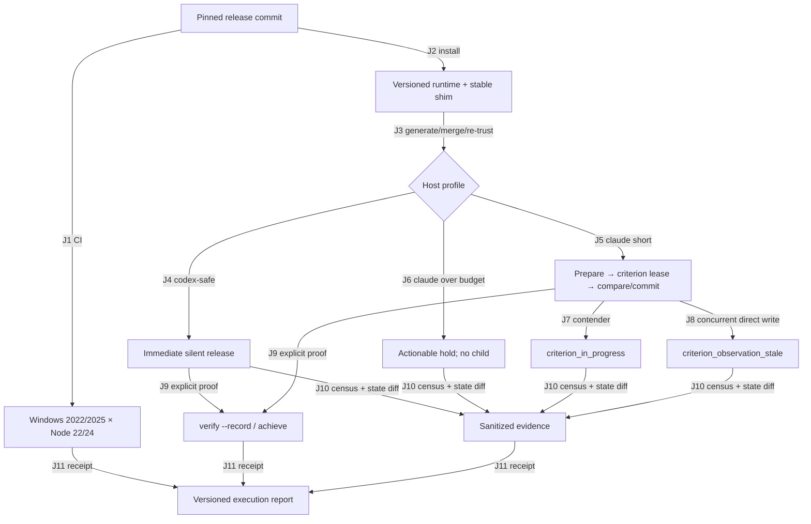

# Stop Hook liveness Slice 4 端到端测试计划

- Artifact ID: `stop-hook-liveness-e2e/2026-07-21`
- Contract version: `e2e-plan/v1`
- 模式：Delta Plan（只覆盖本次 Stop capability、外部 criterion transaction、迁移与真实 Host blast radius）
- 来源计划：`docs/plans/2026-07-21-stop-hook-liveness-root-fix.md`
- 数据默认：`preserve traces`，除非用户明确覆盖；仓库只保留脱敏 execution report，不保留原始 Host transcript、账号、session id 或本机绝对路径

## 概览

- 覆盖 `J1–J11`、10 个场景；授权后的 Core Slice 为 `SHL-E2E-001–010`。
- 最高风险是两类：把 release-only Host 重新接成可持久化 block；以及在真实 hard Stop 中恢复 session 时，criterion lease/stale compare-and-commit 与 Host continuation 发生错配。
- 当前开放缺口：`GAP-001` 用户级安装/Hook 配置/重新 trust/真实 session 未授权；`GAP-002` Codex App UI 探针需要可操作的真实 App；`GAP-003` Windows 证据需要授权提交并推送当前 diff。
- Core Slice 退出条件：Codex CLI 与 App 各连续 10 次 Stop；Claude short/over-budget/in-progress/stale 全部通过；Windows 四组合全绿；脱敏 receipt 完整；任何一项无证据都不是 pass。

## 1. 来源清单

| 来源 | Authority / receipt | 本计划用途 |
|---|---|---|
| `docs/plans/2026-07-21-stop-hook-liveness-root-fix.md` | Oracle 1–11、Slice 4、迁移/回滚/权限边界 | 业务验收权威 |
| `docs/plans/2026-07-15-host-hook-adapter-and-safe-stop.md` | Codex App 10-Stop、bad message-id 历史、真实 session 授权边界 | App blast radius 与隐私边界 |
| `lib/host-hooks.mjs` | `hostProfileCapability`, `STOP_INLINE_CRITERION_SECONDS`, `STOP_RUNTIME_DEADLINE_SECONDS`, `STOP_RECIPE_TIMEOUT_SECONDS`, `encodeHook` | profile 与 30/35/45 秒合同 |
| `lib/application.mjs` | `prepareTaskObservation`, `executePreparedObservation`, `commitPreparedObservation`, `hookStop`, `dispatchHook` | release-only fast path、hard Stop、stale/single-flight 行为 |
| `lib/criterion.mjs` | `repositoryContentFiles`, `repoSnapshot`, `runCriterionSource` | ignored-file fingerprint、child timeout 与 side-effect 观察 |
| `lib/task-store.mjs` | `withCriterionLease`, `readCriterionLease`, cleanup margin | lease ownership、deadline 与 reaper |
| `install.mjs` | `inspectCodexHookProfiles`, `inspectClaudeHookProfile`, runtime activation | 只读旧 recipe 诊断、安装边界 |
| `skills/loop-core/HOSTS.md` | Claude hard Stop、Codex CLI/App release-only、显式长验收 | Host 操作契约 |
| `tests/host-hooks.test.mjs` | capability 与 byte encoding | 真实 Host 前的 contract 基线 |
| `tests/workloop.test.mjs` | release-only、too-long、lock isolation、direct ignored write、single-flight、child cleanup | 本地 subprocess 基线 |
| `tests/workloop-architecture.test.mjs` | 无 lock-held criterion、lease liveness、intent/fingerprint fail-closed | 并发与静态边界 |
| `tests/windows.test.mjs` / `.github/workflows/test.yml` | `[W06]` release-only/lease 与 Windows 2022/2025 × Node 22/24 | Windows release gate |
| 当前只读 preflight | Claude Code `2.1.216`、Codex CLI `0.144.5`；两份用户 recipe 均仍是 timeout 300 | `待验证` live 环境基线；版本只记录到 receipt，不外推兼容性 |

### 文档-代码语义差异

| Contract | Code behavior | Delta | Risk | Resolution |
|---|---|---|---|---|
| `codex-safe`、`codex-cli-legacy`、unknown Stop 为 release-only | capability map 均为 `release_only`；`hookStop` 在 task authority 前返回 | match | — | `SHL-E2E-002/003` 验证真实消费 |
| 只有 Claude 可 hard Stop，且只内联 ≤30 秒 criterion | `claude` 为 `hard`；30/35/45 常量同源 | match | — | `SHL-E2E-004/005` |
| 外部 criterion 不持 `.task.lock` | prepare/execute/commit 三阶段；执行受 `.criterion.lock` 串行化 | match | — | `SHL-E2E-006/008` |
| authority token 必须覆盖 intent 与 repo content | token 含 `intent`；snapshot 包含 ignored files；缺失 fingerprint 时 stale | match | — | `SHL-E2E-007` |
| Installer 只诊断、不能静默改用户 recipe | dry-run 报两份 300 秒 recipe 并保留文件 | match | — | `SHL-E2E-001` |
| 真实 Host 与 Windows evidence 是 Oracle 11 的一部分 | 仓库测试已绿，但真实 recipe 尚未迁移、9 个 Windows-only case 本地 skipped | P1 未完成验收，不是代码 delta | P1 | `SHL-E2E-001–010`；当前 `OPEN` |

## 2. 业务流与旅程图



| Edge | 消费 | 产出 / 状态变化 | 来源 |
|---|---|---|---|
| J1 | `RELEASE_COMMIT`、远端分支 | 四个 Windows job 结论与 URL | workflow `windows` matrix |
| J2 | 同一 commit 的 source tree、用户安装授权 | runtime digest、stable shim；不改 Host config | `install.mjs` |
| J3 | 生成的 45 秒 recipes、用户确认 | Codex=`codex-safe`、Claude=`claude`，mode=`nudge`；真实 trust | `cmdHooks`, Slice 4 |
| J4 | Codex Stop payload | zero stdout release；无 task/criterion mutation | `hookStop`, `encodeHook` |
| J5 | Claude Stop、≤30 秒 criterion | block feedback 或 terminal release | `adjudicateClosure`, `presentHookClosure` |
| J6 | Claude Stop、timeout >30 | `criterion_requires_explicit_verification`；sentinel 不存在 | `prepareTaskObservation` |
| J7 | live criterion lease + second Stop | 快速 `criterion_in_progress`；只有 owner child 执行 | `activeCriterionLease`, `withCriterionLease` |
| J8 | prepared observation + direct ignored-file write | stale feedback；0 round/closure；side-effect evidence 使 review 失效 | `repoSnapshot`, `commitPreparedObservation` |
| J9 | release-only 或长验收 task | CLI observation 在 task lock 外执行并按 policy 记录/关闭 | `cmdVerifyRecord`, `achieve` |
| J10 | live Hook rows + before/after hashes/status | census delta、events hash、round/observation/lifecycle delta | `ledger --json`, `status` |
| J11 | 所有场景摘要、CI URL、版本与 digest | 不含敏感数据的 execution report | 原计划 receipt 边界 |

## 3. Agent 执行合同

- **目标面**：`node install.mjs --dry-run`、授权后的 `node install.mjs`、installed `workloop hooks/hook/status/ledger/verify --record/achieve`、Codex CLI `exec/resume`、Codex App UI、Claude Code `-p/--resume`、GitHub Actions Windows matrix。代码/CLI 面为`已确认`；App UI 可操作性为`待验证`。
- **测试数据**：每个 Host 使用独立临时 Git repo。共同文件：`check.mjs`（快速 `exit 1`）、`done`（满足标记）、`long.mjs`（若被 spawn 则在 fixture 外写 sentinel 并等待）、`slow.mjs`（写 sentinel 后等待 5–25 秒）、`.gitignore` 与 `ignored.txt`。fixture recipe 必须先用 `check.mjs` 快速 open，再 `amend` 到 long/slow criterion；不得让 birth observation 睡眠。
- **变量传递**：`RELEASE_COMMIT`、`RUNTIME_DIGEST`、`CODEX_REPO`、`APP_REPO`、`CLAUDE_SHORT_REPO`、`CLAUDE_LONG_REPO`、`CLAUDE_LEASE_REPO`、`CLAUDE_STALE_REPO`、`EVENTS_SHA_BEFORE`、`ROUNDS_BEFORE`、`OBSERVATION_ID_BEFORE`、`CENSUS_COUNT_BEFORE`、`CODEX_THREAD_HANDLE`、`CLAUDE_SESSION_HANDLE`、`CI_RUN_URL`。Session handles 仅存在 executor transient memory，不写 receipt。
- **探针/Oracle**：Host 进程退出与 UI 是否可继续；`ledger --json` 的 `integrity.censuses` 增量；`events.jsonl` SHA-256；`status` 的 rounds、artifact revision、last observation、lifecycle；sentinel 存在性；`.criterion.lock`；CI conclusion。Live Host 只证明真实 consumption；<2 秒 runtime 由 production-subprocess tests 与 Windows CI 的 source-backed timing assertion证明，不拿整段模型响应时长冒充 Hook 时长。
- **等待/预算**：direct Hook timing <2 秒；hard in-progress contender <2 秒；recipe timeout 45 秒；单个 headless Host turn 外层 120 秒；sentinel poll 5 秒、10ms 间隔；Claude slow owner 最多 30 秒；Windows job 20 分钟。禁止盲 sleep；使用 sentinel、process close、CI status polling。
- **隔离/清理**：默认保留自有 fixture 与脱敏 report，直到所有失败完成归因。原始 debug/stream/transcript 只在 Host transient area 查看，不复制进仓库；不得记录账号、session id、本机绝对路径。Host 配置是 `config-change`：修改前保存原字节与 SHA-256；probe 失败时禁用 workloop Stop handler或恢复安全 recipe，绝不恢复 legacy `decision:block`；PreToolUse 尽量保留。备份默认不删除。
- **阻塞/缺口**：`GAP-001` 无用户授权不得安装/改配置/re-trust/创建 session；`GAP-002` Codex App 需要用户可见 UI 或明确授权 Computer Use；`GAP-003` Windows CI 需要授权 commit/push；任一缺口未解除时 executor 必须停止，不得把 unit test 记成 live pass。

Required capabilities：Node 22/24、Git、Codex CLI 登录态、Claude Code 登录态、Codex App、用户级 Hook 配置权限、Host trust UI、GitHub push/Actions 权限。Optional probes：Host debug duration 字段、UI screen recording；可缺失但不得进入仓库。

### 3.1 Fixture 配方

每个场景在自己的临时 Git repo 中使用下列稳定文件；`<SENTINEL>` 必须是 fixture repo 外、由 executor 创建的临时根下的绝对路径，并通过生成脚本安全序列化进 `long.mjs`/`slow.mjs`，不能用未经转义的 shell 拼接：

```js
// check.mjs
import fs from "node:fs";
process.exit(fs.existsSync("done") ? 0 : 1);

// long.mjs / slow.mjs（等待毫秒分别为 60_000 / 25_000 / 5_000）
import fs from "node:fs";
fs.writeFileSync(<JSON-ENCODED-SENTINEL>, "started\n");
Atomics.wait(new Int32Array(new SharedArrayBuffer(4)), 0, 0, <WAIT_MS>);
process.exit(1);
```

共同初始化顺序：`git init`；写入并提交 `check.mjs`、`.gitignore`（内容为 `ignored.txt`）和 `ignored.txt=before`；用 installed `workloop open --repo . --goal "stop liveness probe" --criterion-file check.mjs --criterion-policy default --criterion-timeout-seconds <T> --alignment-because "the checker exercises the live Stop path" --not-covered "host transport outside this fixture" --files done --files ignored.txt --risk routine --risk-reason "isolated reversible Host fixture" --review-policy risk-based` 创建 unsatisfied task；再用 `workloop amend --repo . --criterion-file <long-or-slow>.mjs --reason "live Host liveness characterization"` 切换 criterion。各场景的 `<T>`/文件为：Codex=`900/long.mjs`，Claude over-budget=`31/long.mjs`，Claude in-progress=`30/slow-25.mjs`，Claude stale=`5/slow-5.mjs`；Claude short 保持 `5/check.mjs`，不 amend。该 assurance 配置是为了只验证 Host/criterion 行为；本生产变更本身仍受主任务的 critical + second-model review 门禁约束。

Birth observation 必须先由 `check.mjs` 快速完成。所有异步进程使用结构化进程 API 持有 handle、收集 stdout/stderr、设置外层 deadline 并在 `finally` 等待关闭；不得使用 `command &`、固定 `sleep` 或 PID 猜测。探针前后读取 `workloop status --repo .`、`workloop ledger --json --repo .` 与 `.workloop/events.jsonl` SHA-256；原始输出仅留在 transient area，report 只抄录第 8 节字段。

## 4. 风险地图

| 风险族 | 失败模式 | 场景 |
|---|---|---|
| Main path | 新 runtime 已安装但 Host 仍消费旧 300 秒 recipe | SHL-E2E-001 |
| Cross-surface | CLI 结果错误外推给 App，或 App 保存不可重放 block prompt | SHL-E2E-002/003 |
| Boundary | timeout 30/31 边界启动了错误 child | SHL-E2E-004/005 |
| Concurrency | 两个 hard Stop 都运行 criterion；task lock 被 owner 占住 | SHL-E2E-006/008 |
| Consistency | direct ignored write 未进入 fingerprint，旧 observation 收口 | SHL-E2E-007 |
| Recovery | child/Host 被杀后 lease 永久占用或被过早偷取 | SHL-E2E-006/009 |
| Explicit proof | release-only Stop 被误当 proof，长 criterion 永远不记录 | SHL-E2E-008 |
| Cross-platform | Windows child cleanup、path/lock/timeout 与 POSIX 分叉 | SHL-E2E-009 |
| Rollback | App probe 失败却恢复 legacy block，重新损坏 session | SHL-E2E-010 |
| Observability/privacy | receipt 含 transcript、账号、session id、绝对路径，或缺少可审计计数 | SHL-E2E-010 |

## 5. 场景总览

| 场景 | 分组 | 优先级 | 切片 | 风险/目的 | 探针/Oracle | 覆盖边 | 通道 | 副作用类型 | 数据策略 | 关联 Issue |
|---|---|---:|---|---|---|---|---|---|---|---|
| SHL-E2E-001 迁移 preflight 与激活 | migration | P0 | Core Slice / blocked | 保证 Host 真正消费同一 45 秒 runtime | dry-run 先告警 300；安装后 digest 固定；parsed recipe 为正确 profile/mode/45；真实 census 出现 | J1–J3,J10 | CLI/config/trust | config-change | 备份保留；失败走安全回退 | none |
| SHL-E2E-002 Codex CLI 10-Stop | Codex CLI | P0 | Core Slice / blocked | release-only 不运行 900 秒 criterion | 同一 session 10 个 census；下一 turn 正常；events hash/round/observation 不变；sentinel absent | J4,J10 | CLI/live session | additive-retained | 保留脱敏摘要；不留 transcript | none |
| SHL-E2E-003 Codex App 10-Stop | Codex App | P0 | Core Slice / blocked | App 不再持久化 legacy block/bad id | 同一 task 10 个 census；第 11 条用户消息成功；0 API error、0 bad-id workloop prompt；task proof 不变 | J4,J10 | UI/live session | additive-retained | 只记 bool/count/version | none |
| SHL-E2E-004 Claude short hard Stop | Claude | P0 | Core Slice / blocked | 保留 unsatisfied hold 与 satisfied close | 同一 session 首次 block 恢复；agent 写 `done`；下一 Stop terminal achieved；只有预期 round | J5,J10 | CLI/live session | additive-retained | 独立 fixture 保留 | none |
| SHL-E2E-005 Claude over-budget | Claude | P0 | Core Slice / blocked | >30 秒不启动 child且给可执行路径 | feedback 含 `criterion_requires_explicit_verification` + verb；<2 秒 subprocess baseline；sentinel absent；0 round | J6,J10 | CLI/live session | additive-retained | 独立 fixture 保留 | none |
| SHL-E2E-006 Claude in-progress | concurrency | P0 | Core Slice / blocked | single-flight 与 task-lock liveness | owner lease active 时 Host Stop 得到 `criterion_in_progress`；无第二 child；status/suspend 可用；owner finally releases | J5,J7,J10 | two processes/live Host | additive-retained | 保留 pid-free摘要 | none |
| SHL-E2E-007 Claude stale direct write | concurrency | P0 | Core Slice / blocked | Hook-bypass ignored write不能旧证收口 | sentinel 后直写 ignored file；Host 收到 stale；0 round/closure；artifact +1；side-effect evidence retained | J5,J8,J10 | process + filesystem | additive-retained | 独立 fixture 保留 | none |
| SHL-E2E-008 显式长验收 | explicit proof | P1 | Core Slice / blocked | release-only 的 proof 由 CLI 承接且不占 task lock | `verify --record`/`achieve` 运行时 status/suspend <500ms subprocess baseline；fresh satisfied proof 按 policy 记录/关闭 | J9,J10 | CLI/process | additive-retained | 独立 fixture 保留 | none |
| SHL-E2E-009 Windows release gate | Windows | P0 | Core Slice / blocked | 真实 Windows cleanup/lease/release-only | Windows 2022/2025 × Node 22/24 四 job 全绿；`[W06]` 两 case 实际执行非 skip | J1,J11 | GitHub Actions | external-file | 保留 run URL/conclusion | none |
| SHL-E2E-010 Receipt、隐私与安全回退 | closeout | P0 | Core Slice / blocked | 证据可审计且失败不恢复危险配置 | 所有 required field 有值；禁止字段零命中；任何 probe fail 时 Stop disabled/release-only，PreToolUse 状态记录 | J10,J11 | docs/config | config-change | report versioned；原始数据不入库 | future executor issue only on failure |

## 6. 详细场景

### SHL-E2E-001 迁移 preflight 与激活

- Index: node `N1` | priority P0 | Side-effect Class `config-change` | readiness gate → `GATE-AUTH-HOST`
- **目的**：排除“代码已修但真实 Host 仍运行旧 runtime/300 秒 recipe”。
- **来源**：主计划 Slice 4/迁移顺序；`install.mjs`; `cmdHooks`。
- **覆盖边**：J1–J3,J10。
- **准备**：固定 `RELEASE_COMMIT`；读取而不复制用户配置；记录 sanitised handler projection 与原字节 SHA-256。
- **步骤和依赖**：先 `node install.mjs --dry-run` 并要求两份旧 timeout 告警；授权后提交/CI 固定 commit，再执行 installer；由 installed shim 生成 Codex/Claude recipes；用户人工合并、重新 trust/restart；在每个 fixture 执行 `hooks --action record-install`，再触发一次 PreToolUse + Stop census。
- **期望**：安装前为 300 告警；安装后 handlers 分别为 `codex-safe`/`claude`、`nudge`、timeout 45；命令指向 stable shim；live `ledger --json` 显示 census，证明 Host 消费而非只生成。
- **自动化级别**：E2E migration + manual trust。
- **隔离/清理**：修改前备份；成功后保留新安全 recipe；失败按 SHL-E2E-010 禁用 Stop 或恢复 release-only，绝不恢复 Codex legacy block。

### SHL-E2E-002 Codex CLI 同一 session 10 次 Stop

- Index: node `N2` | priority P0 | Side-effect Class `additive-retained` | readiness gate → `GATE-CODEX-CLI`
- **目的**：证明真实 Codex CLI 消费 silent release-only wire contract，且 900 秒 criterion 从未 spawn。
- **来源**：主计划 A1/Slice 4；HOSTS Codex CLI；`release-only Stop profiles...` test。
- **覆盖边**：J4,J10。
- **准备**：独立 repo；quick unsatisfied open（timeout 900）后 amend 到写外部 sentinel 的 `long.mjs`；记录 event hash、round、observation、census baseline。
- **步骤和依赖**：首个 `codex exec --json` prompt 明确要求用 shell 运行一次只读 `workloop status` 再回复固定 token，以建立 PreToolUse anchor；从 transient JSON 取 thread handle；用当前 CLI 已确认的 `codex exec resume --json <handle> <prompt>` 形态连续提交 9 个“不用工具，只回复固定 token”的 turn；再提交第 11 个普通 turn。
- **期望**：前 10 个 probe turn 均正常返回，probe 后 Stop census 增量精确为 10；第 11 个普通 turn 也正常返回，其 Stop 后总 census 增量为 11，且最后 `pretooluse_armed=true`；无 legacy hook prompt；event hash、round、last observation、lifecycle 不变；sentinel 始终不存在。
- **自动化级别**：真实 CLI E2E。
- **隔离/清理**：session handle/raw JSON 不入库；report 只记版本、turn/census/error 计数和 task diff。

### SHL-E2E-003 Codex App 同一 task 10 次 Stop

- Index: node `N3` | priority P0 | Side-effect Class `additive-retained` | readiness gate → `GATE-CODEX-APP`
- **目的**：证明 App 不再把 workloop block 持久化成不可重放的 user-shaped message。
- **来源**：主计划 A1/Slice 4；2026-07-15 adapter plan L01；HOSTS Codex App。
- **覆盖边**：J4,J10。
- **准备**：与 SHL-E2E-002 等价但独立 fixture；App 打开一个新 task，首轮要求一次只读 workloop command 以建立 PreToolUse anchor。
- **步骤和依赖**：同一 App task 连续 10 个 user→assistant turns；每次观察 Stop 状态是否立即消失且无 resume prompt；第 11 条发送普通消息并等待响应；只读检查 error stream/session metadata 中与 workloop 相关的 bad-id/API error 计数。
- **期望**：第 10 个 probe turn 后 census 增量精确为 10；第 11 条普通消息成功且其 Stop 后总增量为 11；`invalid_id_prefix`/replay error=0；非 `msg` 的 workloop hook-prompt id=0；task event/round/observation 不变；sentinel absent。
- **自动化级别**：真实 UI E2E / manual exploratory。
- **隔离/清理**：不保存 screenshot、transcript、session path/id；report 只记 bool/count/App version。发现一次 bad id 立即执行安全回退并停止后续 App probes。

### SHL-E2E-004 Claude short hard Stop

- Index: node `N4` | priority P0 | Side-effect Class `additive-retained` | readiness gate → `GATE-CLAUDE`
- **目的**：证明 capability 分流没有删除 Claude 的 session-internal hard gate。
- **来源**：Oracle 4；HOSTS Claude；byte/behavior tests。
- **覆盖边**：J5,J10。
- **准备**：timeout 5 的 criterion：`done` 不存在 exit 1，存在 exit 0；envelope 包含 `done`。
- **步骤和依赖**：headless/interactive Claude prompt 要求首轮不写 `done`，收到 Stop unsatisfied feedback 后写 `done` 再结束；等待同一 session 的第二个 Stop。
- **期望**：首次 Stop block 并自动恢复同一 session；PreToolUse 记录 `done` write；第二次 Stop fresh satisfied 并 terminal achieved；无 host error，round/attempt 数与事件链一致。
- **自动化级别**：真实 Claude E2E。
- **隔离/清理**：独立 repo 保留；receipt 不含 session handle/transcript。

### SHL-E2E-005 Claude over-budget 不 spawn

- Index: node `N5` | priority P0 | Side-effect Class `additive-retained` | readiness gate → `GATE-CLAUDE`
- **目的**：证明 timeout 31/900 在真实 hard Host 中走显式路径，不支付 child 成本。
- **来源**：Oracle 3/10；`hard Stop refuses criteria above...` test。
- **覆盖边**：J6,J10。
- **准备**：quick open timeout 31，amend 到写 sentinel 后等待的 criterion；prompt 指示收到 explicit-verification feedback 后运行 `workloop suspend --repo . --reason needs-input --remaining "run the explicit criterion" --failure "inline criterion exceeds the hard Stop budget" --next-action "run workloop verify --record outside Stop"`，防止重复 block。
- **步骤和依赖**：启动一轮 Claude；等待 Stop feedback 和随后的 suspend/release；检查 sentinel、task events 和 rounds。
- **期望**：feedback 含稳定 code 与 `verify --record` 或 `achieve`；sentinel absent；0 observation/round；suspend 后 Stop release；local/Windows production-subprocess timing assertion <2 秒。
- **自动化级别**：真实 Claude + contract timing。
- **隔离/清理**：fixture 保留；suspended task 不复用。

### SHL-E2E-006 Claude criterion_in_progress

- Index: node `N6` | priority P0 | Side-effect Class `additive-retained` | readiness gate → `GATE-CLAUDE`
- **目的**：证明真实 Host contender 不等待、也不启动第二 child，且 task control lock 可用。
- **来源**：Oracle 6/8/9；lease/lock tests。
- **覆盖边**：J5,J7,J10。
- **准备**：timeout 30 的 slow unsatisfied criterion；外部受控 process 运行 `verify --record`，写 sentinel 后等待约 25 秒；所有 background process 必须有 PID handle、stdout/stderr capture 和 finally wait，不能 fire-and-forget。
- **步骤和依赖**：sentinel 后启动 Claude 单轮；并行运行 `status` 与一次可撤销 `suspend` probe；Claude 收到 in-progress 后执行已预置的 suspend/release 路径；等待 owner process 结束。
- **期望**：Host feedback=`criterion_in_progress`；第二 sentinel/PID 不存在；status/suspend 在 source-backed 小预算内完成；owner child 结束后 `.criterion.lock` 消失；无 contender round。
- **自动化级别**：concurrency E2E。
- **隔离/清理**：保留 fixture；receipt 只记 process count、durations、exit/result，不记 PID。

### SHL-E2E-007 Claude stale direct ignored write

- Index: node `N7` | priority P0 | Side-effect Class `additive-retained` | readiness gate → `GATE-CLAUDE`
- **目的**：证伪 Hook-bypass ignored content 是否仍能用旧 observation 收口。
- **来源**：Oracle 7、反转测试；`Stop discards ... direct ignored-file write` test。
- **覆盖边**：J5,J8,J10。
- **准备**：timeout 5 slow criterion 写外部 sentinel；repo 有 ignored `ignored.txt=before`；记录 task revisions/rounds/lifecycle。
- **步骤和依赖**：异步启动 Claude；等待 criterion sentinel 后，由 executor 直接把 ignored file 改为同长度或不同长度新值；等待 Host stale feedback；按 prompt suspend 以安全释放 session。
- **期望**：feedback 包含 `criterion_observation_stale`；不关闭、不计 round/attempt；artifact revision +1、last observation 为 indeterminate side-effect evidence、changed path 精确；旧 review 不再 accepted。
- **自动化级别**：concurrency/recovery E2E。
- **隔离/清理**：直接写只发生在专用 fixture；不恢复文件，保留证据。

### SHL-E2E-008 显式长验收与 lock liveness

- Index: node `N8` | priority P1 | Side-effect Class `additive-retained` | readiness gate → `GATE-HOSTS`
- **目的**：证明 release-only Stop 不产生 proof，而 `verify --record`/`achieve` 可以承接长验收。
- **来源**：主计划 A4/§5；verify/achieve lock-isolation tests。
- **覆盖边**：J9,J10。
- **准备**：Codex fixture 保持 active；criterion 改为可由 `done` 满足的显式长 timeout；记录 Stop 前后无 proof 的状态。
- **步骤和依赖**：在最后 write 后从 Host 内运行 `workloop verify --record`（default）或 `workloop achieve`（explicit）；criterion 运行时从第二 process 执行 status；完成后读取 authority。
- **期望**：release-only Stop 本身无 observation；显式 verb 写 `cli_verify`/`achieve` provenance；status 不因 task lock 超时；fresh satisfied 按 policy eligible/terminal。
- **自动化级别**：CLI E2E。
- **隔离/清理**：独立 fixture 保留。

### SHL-E2E-009 Windows 四组合 release gate

- Index: node `N9` | priority P0 | Side-effect Class `external-file` | readiness gate → `GATE-GIT-CI`
- **目的**：取得本机无法提供的真实 Windows child/lock/path 证据。
- **来源**：Oracle 1/9/11；workflow 与 `[W06]` tests。
- **覆盖边**：J1,J11。
- **准备**：当前 diff 形成用户批准的 commit 和 `codex/*` 分支；不夹带无关变化。
- **步骤和依赖**：push 后等待 workflow；检查 Windows 2022/2025 × Node 22/24 每个 job；确认 `[W06] Windows codex-safe...` 与 `[W06] Windows criterion lease...` 在日志中实际 pass 而非 skip；保存 run URL/conclusion。
- **期望**：四个 Windows jobs 与 portable jobs 全绿；无 continue-on-error；W06 两项实际执行；child termination 和 installer/architecture/behavioral groups 全绿。
- **自动化级别**：CI E2E。
- **隔离/清理**：远端分支保留到审查结束；不自动删除；receipt 只存 URL、commit、job conclusions。

### SHL-E2E-010 Receipt、隐私与安全回退

- Index: node `N10` | priority P0 | Side-effect Class `config-change` | readiness gate → `GATE-CLOSEOUT`
- **目的**：让真实验收可审计，同时保证失败不会恢复已知危险的 Codex block。
- **来源**：Slice 4 receipt/rollback；2026-07-15 bad-id 回退规则。
- **覆盖边**：J10,J11。
- **准备**：所有 scenario results、sanitized handler projections、CI URL；原始 logs/transcripts 仍在 transient area。
- **步骤和依赖**：创建 `docs/e2e-test/stop-hook-liveness/e2e-run-stop-hook-liveness-<local-timestamp>/execution-report.md`；逐字段抄录聚合结果；运行 forbidden-field scan；任何 required scenario fail 时记录 failure 并执行安全回退，再复测一次 no-task Stop 与 PreToolUse。
- **期望**：report 含 plan id、commit、runtime digest、Host versions、recipe projections、scenario table、10-Stop counts、task deltas、sentinel/lease result、CI URL、rollback state；不含 raw transcript/config、账号、session/thread id、PID、绝对路径；失败配置最终为 Stop disabled 或 release-only，绝非 legacy block。
- **自动化级别**：manual closeout + document validation。
- **隔离/清理**：versioned report 保留；原始 evidence 不入库；备份默认保留。

## 7. 执行 DAG

| 节点 | 场景 | 依赖 | 消费 | 产出 | 所需能力 | 副作用范围 | 隔离键 | 并行安全 | 清理依赖 | 扰动标记 |
|---|---|---|---|---|---|---|---|---|---|---|
| N0 | preflight | none | source tree、现有 configs | authorization/status facts | CLI/read config | none | `RELEASE_COMMIT` | safe | none | none |
| N9 | SHL-E2E-009 | N0 + `GATE-GIT-CI` | approved diff | `CI_RUN_URL`, Windows conclusions | git/GitHub Actions | remote branch | commit SHA | unsafe：remote publish | user decision | remote CI |
| N1 | SHL-E2E-001 | N0,N9 + `GATE-AUTH-HOST` | CI-green commit、config bytes | `RUNTIME_DIGEST`, trusted recipes | installer/config/Host UI | user runtime/config | runtime digest | unsafe：shared config | N10 on failure | config migration |
| N2 | SHL-E2E-002 | N1 | Codex CLI fixture | CLI 10-Stop receipt facts | Codex CLI/live Hook | temp repo + session | fixture marker | safe across other repos | N10 | repeated Stop |
| N3 | SHL-E2E-003 | N1 | Codex App fixture | App 10-Stop receipt facts | Codex App/UI/live Hook | temp repo + App task | fixture marker | unsafe：interactive UI | N10 | repeated Stop |
| N4 | SHL-E2E-004 | N1 | Claude short fixture | hard hold/close facts | Claude/live Hook | temp repo + session | fixture marker | safe across repos | N10 | continuation |
| N5 | SHL-E2E-005 | N1 | Claude long fixture | no-spawn/explicit-path facts | Claude/live Hook | temp repo + session | fixture marker | safe across repos | N10 | timeout boundary |
| N6 | SHL-E2E-006 | N1 | slow owner + Claude fixture | single-flight/liveness facts | two processes/Claude | temp repo/lease | task id | unsafe in same repo | wait owner, then N10 | concurrency |
| N7 | SHL-E2E-007 | N1 | slow Stop + ignored file | stale/revision facts | process/Claude/files | temp repo | task id | unsafe in same repo | N10 | concurrent direct write |
| N8 | SHL-E2E-008 | N2,N4 | Host fixture + done state | explicit proof facts | CLI/Host | temp repo | task id | unsafe in same repo | N10 | long validation |
| N10 | SHL-E2E-010 | N1–N9 | all sanitized facts | execution report、safe final config | docs/config | report + Host config | run id | unsafe：may rollback config | none | closeout/rollback |

## 执行器交接索引

| 字段 | 值 |
|---|---|
| Artifact ID | `stop-hook-liveness-e2e/2026-07-21` |
| Contract version | `e2e-plan/v1` |
| Plan source | 主计划 + current diff + Host/installer/tests/workflow；live runtime facts remain `待验证` |
| Scenario set | `SHL-E2E-001–010`; all required；blocked until gates below |
| DAG nodes | `N0,N9,N1,N2–N8,N10`; disruptive=`N1,N3,N6,N7,N9,N10` |
| Variable ledger | `RELEASE_COMMIT` from approved commit → N9/N1/N10；`RUNTIME_DIGEST` N1→N2–N8/N10；Host facts N2–N8→N10；`CI_RUN_URL` N9→N10 |
| Required capabilities | GitHub push/Actions、installer、user config edit/trust、Codex CLI/App、Claude Code、UI control、two-process harness |
| Data policy anchors | owner marker=`stop-hook-liveness-<run-id>`；fixture/report preserve；transcript/session ids never copy；backup preserve；cleanup only after explicit override |
| Execution blockers | `GAP-001–003`；current timeout=300；App UI and Windows CI not yet reached |

## 8. 验收回执结构

Execution report 必须包含下列稳定字段；字段缺失即 `SHL-E2E-010` fail：

```text
plan_id: stop-hook-liveness-e2e/2026-07-21
run_id: <local timestamp, no absolute path>
release_commit: <git sha>
runtime_digest: <installer digest>
host_versions:
  codex_cli: <version>
  codex_app: <version or observed build label>
  claude_code: <version>
recipes:
  codex: { profile: codex-safe, mode: nudge, timeout_seconds: 45, trusted: true }
  claude: { profile: claude, mode: nudge, timeout_seconds: 45, trusted: true }
scenarios:
  - { id, result: pass|fail|blocked, source_evidence, notes }
codex_cli: { stop_probe_turns: 10, probe_stop_census_delta: 10, post_next_turn_stop_census_delta: 11, next_turn_ok, sentinel_started, task_event_delta, round_delta, observation_delta }
codex_app: { stop_probe_turns: 10, probe_stop_census_delta: 10, post_next_turn_stop_census_delta: 11, next_turn_ok, api_error_count, bad_id_count, sentinel_started, task_event_delta }
claude: { short, over_budget, in_progress, stale, explicit_proof }
windows_ci: { run_url, commit, job_conclusions, w06_executed_not_skipped }
privacy_scan: { raw_transcript: 0, account_identifier: 0, session_or_thread_id: 0, pid: 0, absolute_path: 0 }
final_host_state: { codex_stop: release_only|disabled, claude_stop: hard|disabled, pretooluse_preserved: true|false }
```

Forbidden evidence：原始 transcript/stream JSON、完整用户 config、账号或 token、session/thread/message id、PID、fixture/用户 home 绝对路径、screen recording。CI URL 与 commit SHA 允许。

## 9. 覆盖矩阵

| Requirement / Oracle | 自动化基线 | 真实/远端证据 | 结论规则 |
|---|---|---|---|
| O1 Codex 900 秒 criterion <2 秒且零 proof mutation | workloop + Windows `[W06]` timing | SHL-E2E-002/003/009 | local + Windows timing pass，两个真实 surface consumption pass |
| O2 legacy/unknown release-only、PreToolUse 保留 | host-hooks/workloop tests | SHL-E2E-001–003/010 | recipes 与 census/PreToolUse 均有证据 |
| O3 Claude over-budget actionable/no child | workloop test | SHL-E2E-005 | feedback + sentinel + zero round |
| O4 Claude short hard Stop | byte/behavior tests | SHL-E2E-004 | same-session hold→write→close |
| O5 external criterion 不持 task lock | architecture + explicit path tests | SHL-E2E-006/008 | status/suspend/control probe 无 lock timeout |
| O6 criterion 期间 control commands 快速 | workloop tests | SHL-E2E-006/008 | live/process liveness facts |
| O7 token/state/content change stale | direct ignored-write test | SHL-E2E-007 | stale、0 round/close、revision invalidation |
| O8 single-flight | workloop test | SHL-E2E-006 | one owner、contender in-progress |
| O9 child/lease recovery | timeout/lease/Windows tests | SHL-E2E-006/009 | finally release + Windows recovery |
| O10 30 <35 <45 且 runtime 自限 | host-hooks constants/tests | SHL-E2E-001/005/009 | parsed recipe 45 + no-spawn + CI |
| O11 byte/runtime/behavior/architecture/Windows/live 全过 | `npm test`, diff check, review | SHL-E2E-001–010 | 所有 required rows pass；无 blocked/missing evidence |

## 10. 缺口、假设与问题

| Gap | Disposition | 影响 | 解除条件 |
|---|---|---|---|
| GAP-001 用户级 runtime 安装、Hook config、restart/re-trust、真实 session 未授权 | OPEN | N1–N8/N10 不能执行 | 用户明确授权这些外部状态变化和模型调用 |
| GAP-002 Codex App task 需要可见 UI 与真实登录态 | OPEN | SHL-E2E-003 不能由 CLI 替代 | 用户手动执行或明确授权 Computer Use 操作 Codex App |
| GAP-003 Windows runner 需要 commit/push | OPEN | SHL-E2E-009 未证明 | 用户授权创建 commit、push `codex/*` 分支并等待 Actions |
| GAP-004 Host debug logs 是否暴露单个 Hook duration 字段 | CONDITIONAL | 仅影响额外诊断，不影响 runtime timing hard oracle | executor 若发现稳定字段只记 aggregate；否则依赖 subprocess/Windows timing + live liveness |
| GAP-005 Codex App build label 的稳定读取位置 | CONDITIONAL | receipt 版本字段可能为 observed label | executor 从 UI/About 读取；不可得则写 `unavailable` 并说明，不伪造 |

## 11. Agent 就绪门禁

- **GATE-AUTH-HOST**：用户明确授权 installer 写用户 home、人工/agent 修改两份 Host config、restart/re-trust、创建真实 Codex/Claude sessions 与相应模型调用。未满足即 stop。
- **GATE-GIT-CI**：用户明确授权 commit/push；branch 以 `codex/` 开头；当前 diff 范围确认；GitHub Actions 可访问。未满足即 stop。
- **GATE-CODEX-CLI**：`codex login status` 成功；CLI 版本记录；installed recipe 已被真实 census 证明。
- **GATE-CODEX-APP**：用户确认 App 可操作且允许创建测试 task；recipe 已 trust；发生一次 bad id/API replay error 立即 stop/rollback。
- **GATE-CLAUDE**：Claude auth 成功；`--setting-sources`/真实 user recipe 选择明确；外层 timeout 与 safe suspend prompt 就绪。
- **GATE-HOSTS**：N2/N4 至少先通过，才运行 explicit proof；不能用 direct handler invocation 代替 live Host。
- **GATE-CLOSEOUT**：N1–N9 均有 sanitized facts；失败先完成安全回退，再写 report。
- **Exit**：SHL-E2E-001–010 全 pass、receipt privacy scan 全零、Windows jobs 全绿；否则目标仍未完成。

## 12. 场景切片

- **Core Slice**：`SHL-E2E-001–010`。本计划没有可选的 live oracle；十项共同构成原计划 Slice 4 与 Oracle 11。
- **Extended Slice**：`GAP-004` 的稳定 per-hook duration debug probe；仅增加诊断，不替代任何 hard oracle。
- **Hazardous/Defer**：在未授权前，`SHL-E2E-001–010` 全部 blocked；尤其不得先改用户 config、创建 App session 或 push 远端分支。失败后的 destructive backup cleanup 也 defer，默认保留。

## 13. 执行顺序

`N0 → N9 → N1 → (N2,N4) → (N3,N5,N6,N7) → N8 → N10`。

N2/N4 是最早 live canary；任一失败都先进入 N10 安全回退，不继续扩大到 App/concurrency 场景。不同 fixture repo 的 N2/N4/N5 可并行，但 N3 需独占 UI，N6/N7 在各自 repo 内必须串行并由 executor 持有所有 process handles。
