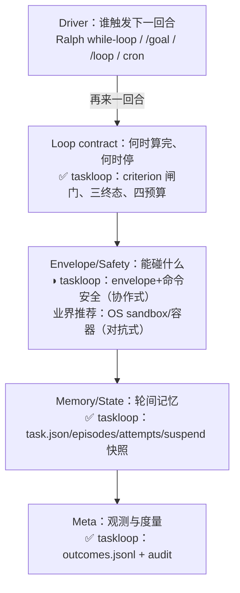

# taskloop vs. loop engineering 最佳实践

**问题**: 本仓库 taskloop（task-first 循环内核：CLI + PreToolUse/Stop hook）的设计，对照业界 loop engineering（agent 工作循环工程）公开最佳实践，处于什么位置？
**深度**: Deep
**核心结论**: taskloop 在"停机裁决 + 验证完整性"层完整覆盖公开最佳实践并有多处机制走在公开资料前面（出生即红、判据输入指纹、判据溯源、weak-close 闸门、grant 溯源、结局账本），刻意不做 driver 与 context 管理两层（声明过的分层而非遗漏），唯一实质差距是执行强度：协作式 fail-open 护栏，低于业界对无人值守自治推荐的 OS 级 sandbox 一档，两者互补而非替代。（同日 spike 缺陷全数修复后该结论才完全成立——此前部分被实现缺陷架空，见「追加 2」。）
**产物类型**: supporting
**验证状态**: current-state checked + UI/runtime tested（lib/ 全部 8 模块与 3 份 skill 文本全读；`npm test` 42 测试 40 过、2 项 Windows 专属跳过、0 失败；外部来源均为本会话拉取；同日追加双宿主真实会话 spike：Claude Code 2.1.207 与 Codex CLI 0.144.1 端到端实测，见文末追加节；**同日再追加**：spike 缺陷全数修复并经 second-model 四轮评审收口，再补一批并发锁 backlog 加固（#5 非有限 timeout fail-closed + reaper 回收 + cmdOpen 超时特征测试），`npm test` 现为 60 测试 58 过 0 失败，见「追加 2」）
**开放问题**: 2 - 见文末

## 证据基础

- 本地：`lib/*.mjs`（application/task-engine/criterion/supervision/untracked/outcome-ledger/task-store/prims）、`skills/workloop/SKILL.md`、`skills/loop-core/REFERENCE.md`、`skills/loop-core/ADAPTERS.md`、`README.md`、`AGENTS.md`、`.github/workflows/test.yml`（CI：3 OS × Node 22/24）。
- 外部（2026-07-11 拉取）：Anthropic《Building effective agents》《Building agents with the Claude Agent SDK》、Claude Code 官方 best practices、Simon Willison《Designing agentic loops》(2025-09)、Geoffrey Huntley《Ralph Wiggum》、HumanLayer《12-factor agents》、Cognition《Don't Build Multi-Agents》、Böckeler《Harness engineering》(martinfowler.com, 2026-04)、tosea.ai 与 claudeskills.info 的 loop engineering 专文（2026-06，二级综述，仅采信与一手 canon 一致的部分）。

## 定位：业界分层中 taskloop 的位置

确立：taskloop 占后四层的机器裁决部分、在 Safety 层只做协作式强度；Driver 层明确拒绝（`AGENTS.md:18`："Schedulers that trigger another round remain outside this repository"；`skills/workloop/SKILL.md:108-110` 要求无 host driver 时声明降级为单回合）。未验证：hook 在真实会话中的端到端拦截（见开放问题 1）。

## 逐维度对比

| 维度 | 公开最佳实践 | taskloop | 判定 |
|---|---|---|---|
| 机器可查完成判据 | "Give Claude a check it can run"；"trust the checker, not the transcript" | open 强制 criterion + alignment；只有 fresh green 关单 | 达标且更严 |
| 防 reward hacking | 确定性验证 + fresh-context 评审 | 指纹、溯源、weak-close、done 重试烧轮次 | **超出** |
| 停机与预算 | max iterations、token/wall-clock 上限、no-progress 检测 | rounds=8 + 可选 writes/wall-clock/tokens、任务级不回填、stuck/交替检测 | 达标+ |
| 写边界与安全 | 容器/OS sandbox、网络白名单、allowlist | envelope glob + PreToolUse deny + 命令安全正则；自认非 sandbox | 意图一致，**强度低一档** |
| 暂停/恢复/状态外置 | 12-factor #6/#8/#9/#12；"externalize state to files" | task.json + episodes + attempts + 纯 reducer `transition()` | 达标（教科书式） |
| 人在环 | operator gate；"autonomy budget ≠ approval budget" | needs_input、人独占 not-needed/abandon、git 双闸、granted-by | 达标 |
| 独立评审 | fresh-subagent 对抗评审；"never self-review in the same window" | 独立性阶梯 + review provenance 记账 + weak-close 强制 | 达标+ |
| 观测/元循环 | intervention rate、cost per change；"unmeasured changes are vibes" | outcomes.jsonl + `audit`（field-trust 自检） | 达标+ |
| Driver | Ralph while-loop、/goal、调度器 | 明确拒绝；无 host driver 时降级单回合 | 范围外（声明的 seam） |
| Context 管理 | compaction、subagents、每轮 fresh context | 只做错误尾部回注 + resume banner，其余归 host | 范围外（合理分层） |
| 并发 | git worktrees、单线程 agent（Cognition） | one writer per worktree + integrator（`skills/loop-core/REFERENCE.md:107-109`） | 达标 |

### 验证层：全部来源的第一条，taskloop 最强的一层

Anthropic 的 agent loop 定义为 "gather context → take action → verify work → repeat"，规则型反馈（lint/测试/编译器）被列为最强验证，LLM-as-judge 被明确评为 "generally not a very robust method"。Claude Code 官方把验证做成阶梯：prompt 内检查 → `/goal` 条件 → Stop hook 确定性闸门 → fresh-context 对抗评审，并要求 "show evidence rather than asserting success"。taskloop 把这条阶梯做成了 CLI：

- Stop hook 现场重跑判据（`lib/application.mjs:1133`）；`done` 也现场重跑，两扇关单门共用同一段 `adjudicateGreen`（`lib/application.mjs:641`），无任何 claim-based 成功路径。
- 收敛巧合：Claude Code 的 Stop hook 连续 8 次 block 后强制放行；taskloop 默认轮次预算恰为 8（`lib/prims.mjs:13`）——两边独立收敛到同一个防无限循环常数。

### taskloop 超出公开资料的机制

以下机制在本次全部 10 份来源中均无对应物：

1. **出生即红**：`open` 拒绝已绿判据（`lib/application.mjs:346-353`）。业界只要求"有可查判据"，无人要求判据先证明自己能分辨"没做"与"做完"。
2. **判据输入指纹 + drift 拒关**：改测试不改代码 = "sensor 被挪动"，两扇门都拒绝（`lib/criterion.mjs:343-359`、`lib/task-engine.mjs:187-190`），只能 `amend --reason` 重新指纹，drift 事件永久留账。这是对 "checker theater" 的机器化处理，公开指南只有口头告诫。
3. **判据溯源 + weak-close 闸门**：session 自写检查器（state-dir）标记为"作者给自己打分"，绿也不能自关，必须 fresh-context 评审或显式 `--provisional` 记账（`lib/criterion.mjs:263-268`、`lib/task-engine.mjs:144-148`、`lib/application.mjs:626-635`）。
4. **tri-state adapter 协议**：exit 2 = "无法裁决" ≠ "失败"，使 vacuous pass / stale green / collapsed verdicts 不可表达（`skills/loop-core/ADAPTERS.md:24-32`）。
5. **权限扩张溯源账**：self vs user 的 grant 记录 + `self_granted` 上账（`lib/application.mjs:240-268`），"自我授权了多少权力"成为可审计量。
6. **open 也入账**：开而不收在账上可见（`skills/loop-core/REFERENCE.md:103`）——对应 12-factor "unify execution and business state"，审计粒度更细。
7. **done 重试计费**：被拒的 `done` 烧一轮（`lib/application.mjs:481-488`），对 flaky 判据钓绿不免费。

### 六大失效模式覆盖（2026 loop-engineering 专文的枚举）

| 失效模式 | taskloop 覆盖 |
|---|---|
| hallucinated success | ✓✓ 唯一成功路径是 fresh green |
| reward hacking | ✓✓ 指纹/溯源/weak-close 机制群 |
| no-progress loop | ✓ 同签名×3 + A/B 交替检测（`lib/task-engine.mjs:226-245`） |
| cost blowup | ✓ 四预算 + 账本 token 估计 |
| compounding errors | 部分：attempts 死路清单（`lib/task-engine.mjs:58-81`）+ suspend |
| context overflow | 归 host，刻意不做 |

硬覆盖 4 项、记录 1 项、分层让出 1 项；公开工具中未见覆盖面更全者。

## 差距与取舍（按重要度）

1. **执行强度是协作式，不是对抗式。** 代码自述："Nothing here resists a deliberately evasive agent"（`lib/application.mjs:12-15`）；supervisor 异常 fail-open 放行（`lib/application.mjs:1342-1353`）；有已承认的正则盲区（`sed -i` 位置参数写等，`lib/application.mjs:996-999`）。业界对无人值守的推荐是容器/OS sandbox + 网络白名单 + 限额凭证（Willison、Claude Code `/sandbox`）。**这不是要修的 bug，是要叠加的层**：sandbox 管"能碰什么"，taskloop 管"何时算完"，正交（`README.md:130-134` 同此定位）。但拿 taskloop 当安全边界跑 YOLO mode 属于用错。
2. **无 driver 意味着开箱不是完整 loop 系统。** 不接 `/goal`、`/loop` 或 cron 时只有单回合 + 停机门；组合责任在使用者。
3. **小项**：token 预算是 best-effort 估计（账本行内自声明 scope，`lib/application.mjs:64-68`）；review 只记 provenance 不执行评审（与 Anthropic 对 LLM-judge 的评价一致，立场而非缺陷）；rework ratio 等元指标需下游从账本自算。

## 结论的最弱点

- "超出公开最佳实践"基于截至 2026-06 的**公开**文章；两篇 loop-engineering 专文为二级综述（仅采信与一手 canon 一致部分）。各家内部未发表的 harness 可能已有类似机制。
- 源码、测试与 CI 矩阵已验证（`npm test` 40/42 pass）。hook 协议原本只有模拟 stdin payload 测试；同日 spike 已在真实 Claude Code 与 Codex 会话端到端实测（见文末追加节），仍未测：Codex scheduled tasks、read-only 沙箱档、Claude schedule/cron routine。

## 本文不判定

- taskloop 是否应内置 driver 或 sandbox（产品方向决策，属 first-principles 范畴）。
- skill 文本本身的触发与措辞质量。

## 追加：双宿主真实会话 spike 实测（同日）

设置：4 个 `--probe` 玩具任务；绿路判据 = out.txt 含 hello，挂起路判据 = sha256 锁死的秘密词（agent 不可达）。宿主：Claude Code 2.1.207（`claude -p` + `/goal`，haiku 子模型）、Codex CLI 0.144.1（`codex exec -s workspace-write`，账号默认模型）。原开放问题 1 由此回答：**hook 协议在两宿主真实会话中端到端兼容**，且行为与模拟 payload 测试一致。

### 双宿主对照

| 观察点 | Claude Code（+/goal） | Codex（exec，workspace-write 沙箱） |
|---|---|---|
| 绿路收 done | ✓ `writes=1`、`rounds=0`、账本双行 | ✓ 同左；默认沙箱不影响 hook 进程 |
| Stop block 驱动续跑 | ✓ block 理由作为 feedback 注入 | ✓ block 理由作为 "resume message" 注入 |
| `needs_input` 挂起后 | `/goal` evaluator 挂起盲：连推 ~8 次（与官方"Stop hook 连续 8 次 block 强制放行"上限吻合），烧到 rounds 9/8，预算毁 | 无第二驱动：stall 探测 3 轮止损，会话干净结束，预算剩 5/8 |
| agent 自跑 CLI 动词 | 账本行正常 | task.json 正常写；`~/.taskloop/outcomes.jsonl` 被沙箱拦、静默丢行 |
| token 遥测（估计） | ✓ | ✓ |

两条挂起路上 agent 行为均正确（按指示 `suspend needs_input`、不乱猜、零越界写；envelope 全程护住 `writes=0`）。空转全部源于机器侧缺陷。

### spike 发现的缺陷（按严重度）

*（状态更新见文末「追加 2」：1–5 已闭合，6 属宿主侧配置。本节保留当日发现原貌。）*

1. **`hookStop` 挂起盲（P0，两宿主共享）**：挂起任务的 Stop 仍跑判据→block→烧轮次（`lib/application.mjs` 的 `hookStop` 无 `task.suspension` 检查，而 `hookPretool` 有）。后果：`needs_input` 后预算被空转吃穿（Claude+goal 下 0→9），resume 后写被 `rounds>=budget` 拒，任务实质变砖直到 `amend --rounds`。修复方向：`hookStop` 入口见 suspension 即放行。
2. **rounds 可超预算**（9/8）：stuck 分支不检查 cap；账务小缺陷。
3. **untracked gate 拦仓库外写**：bucket≥2 后任何 write-shaped 调用被拒，包括目标在仓库外的绝对路径写（Write 工具实测两次被拒），与 `lib/application.mjs:996-999` 注释"writes outside this repo … nudge but never gate"矛盾。修复方向：deny 前检查本次调用目标是否在仓库内。
4. **untracked 归因缺陷（两个变体）**：(a) 复合命令内 `cd` 后的相对重定向按 payload cwd 归因，把不存在于该仓库的文件记入 bucket；(b) 未展开的 `$VAR/../x` 重定向目标按字面解析并折叠成仓库内路径。两者都会毒化 bucket 触发误拦。至少应校验文件存在性再入账。
5. **Codex 沙箱分割 taskloop 写面**：agent 在沙箱内跑 CLI 动词时账本 append 被拦且完全静默（`appendOutcomeRow` 降级不出声），审计链在 agent 侧断裂。绑定配方：`--add-dir ~/.taskloop`；taskloop 侧账本写失败应出一行 stderr。
6. **配置疣**：Codex 警告 hooks 同时存在于 `~/.codex/hooks.json` 与 `config.toml` 两层，应合并单源。

### 对宿主绑定设计的输入

- Claude 绑定：`/goal` 条件必须写成 "taskloop 到达终态**或挂起**"（loop 该停了），成败由账本判定；否则 goal 与诚实挂起对抗到其 8 次上限。
- Codex 绑定：会话内 stop-block 驱动开箱即用；跨会话交给 scheduled tasks（云管理，本地未测）；沙箱配对必须放行 `~/.taskloop`。
- 系统变更记录：Codex CLI 经官方 `codex update` 0.142.5→0.144.1（旧版不支持账号默认模型 gpt-5.6-sol）。

## 追加 2：缺陷修复与收口（同日）

spike 缺陷经三批任务修复（P0-①②③、P1-③④⑤，均走 taskloop 自身环：先挣红判据、fresh green 收 done、账本可查），并经 second-model（Codex gpt-5.6-sol，同线程四轮）对抗评审收口——终局判定"可以收口：通过，无新 must-fix"。

| # | 缺陷 | 终态 | 落点 |
|---|---|---|---|
| 1 | hookStop 挂起盲 | 闭 | 挂起任务的 Stop 直接放行，不烧轮次不开 episode（`lib/application.mjs` hookStopLocked 入口） |
| 2 | rounds 超预算 | 闭 | 失败转移封顶于预算；封顶时 out_of_budget 优先于 stuck（`lib/task-engine.mjs`） |
| 3 | untracked gate 拦仓库外写 | 闭 | deny 需本次调用有仓内可归因目标；仓库外/target-less 写只 nudge，实现追平自身声明契约（`lib/untracked.mjs`） |
| 4 | untracked 归因投毒 | 闭（带声明残余） | 先前条目按盘上存在性剪枝 + 未展开 `$VAR` 目标不入账；残余：cd 后与真实仓库文件同名的碰撞需 cwd 追踪，记为已知缺口 |
| 5 | 账本写失败静默 | 闭 | append 失败出一行 stderr（`taskloop: outcome ledger append failed`），修可见性不修恢复（`lib/outcome-ledger.mjs`） |
| 6 | Codex hooks 双层配置 | 宿主侧 | 归入绑定配方（HOSTS.md） |

评审过程另发现并闭合一项 spike 清单外缺陷：**task 状态跨进程写竞态**（hook×verb×open 并发丢更新，12 并发实测丢 9/12）——`lib/task-store.mjs` mkdir 原子锁 + 死锁收割 + fail-closed 超时，全部写路径同一锁域。这使正文对比矩阵两行判定升级：「并发」从约定级（worktree 惯例）升为机制级，且成为第 8 个公开来源无对应物的机制；「观测」的审计链降级从完全静默变为可见。

「对宿主绑定设计的输入」已成文为 `skills/loop-core/HOSTS.md`（随安装分发，测试锚定三条配方与账本降级信号的文码一致性）。缺陷 1 修复后，"/goal 条件须含挂起"从必须降级为建议——预算毁的后果已被机制消除，剩宿主侧浪费推次。

修复后又补一批并发锁 backlog 加固（Codex 认可非阻塞的清单）：**#5** `withTaskLock` 对非有限 timeout（NaN）解析为真实下界并 fail-closed（原本 NaN deadline 使 `Date.now() >= deadline` 永假、锁永不超时空转）——唯一含生产改动项（`lib/task-store.mjs` 新增 `resolveLockTimeoutMs`）；另补两条确定性特征测试覆盖此前仅间接命中的路径：**reaper** 回收崩溃 owner 的陈旧锁、**cmdOpen** 超时干净退出且零提交。跳过三项低值/冗余项（verb×hook 同锁冗余、`open --force` 并发、owner 写失败恢复）。

修复后仍未测：Codex scheduled tasks、read-only 沙箱档、Claude schedule/cron routine；缺陷 3/4/5 的修复证据为单元/端到端测试（`npm test` 60/58/0 失败），未回到真实双宿主会话复现 spike 场景。

## 追加 3：档 1（会话内无人值守）准入验证（同日）

修复后 runtime（`6f7b770adf7f`）带真实沙箱重跑双宿主探针，六臂全过；两条原"未测路径"（Codex read-only 档、沙箱×账本配对）转为实测：

| 臂 | 判定 | 关键证据 |
|---|---|---|
| D3 武装 gate × 仓库外写 | ✓ | 已装 runtime 放行 /tmp 写（缺陷 3 活证） |
| C1 Codex workspace-write 无 `--add-dir` | ✓（缺陷 5 活证） | done 正常绿收；stderr 现 `outcome ledger append failed (EPERM…); row dropped`，**agent 主动向人转述了审计链断裂**；账本 0 行 |
| C2 同上 + `--add-dir ~/.taskloop` | ✓（配方实证） | open+done 两行落账，kind=probe、review 记录随行 |
| C3 Codex read-only 档 | ✓ fail-closed + 新发现 | 零状态写入；但 `open` 以未捕获 EPERM 裸堆栈退出而非干净 cliError（打磨项） |
| A1 Claude 盲 `/goal` × 不可达判据（化石重演） | ✓（P0-① 活证，头条） | **rounds 0/8**（今晨化石 9/8）；恰 1 行 suspended；writes 0；episodes=2 证明驱动确实又推过 |
| A2 Claude 绿路 | ✓ | done 落账；weak-close 强制 provisional 上账（unresolved 溯源） |

**档 1 判定：通过。** 会话内无人值守（宿主沙箱 + HOSTS.md 配方 + 修复后 runtime）可用。附带发现：

1. **Claude 无头模式无沙箱旗标**——Claude 侧 OS 墙要靠交互式 `/sandbox` 或外部容器；无人值守配方须注明。
2. **read-only 档错误通道**：`cmdOpen` 对 EPERM 未走 cliError（新打磨项，backlog）。
3. **review 记录软点活证**：C2 中 agent 自记 fresh-context review 过 weak-close 闸——符合"provenance 不是闸门"的声明立场，但档 2+ 无人值守下值得升级为独立会话评审。
4. **驱动侧脆性**：一次 codex exec 僵死 20 分钟（人工杀）——档 2 前置"驱动自带外层墙钟预算"由此从建议升为必须。
5. 探针级细枝：判据输入在 open 时不存在 ⇒ unresolved 溯源 ⇒ 弱关闭链生效——配方作者应预建输入文件或接受 provisional/review 路径。

## 开放问题

1. 业界内部未公开的 harness 是否已存在与判据指纹/溯源等价的机制，从而削弱"超出公开最佳实践"的判断？
2. 实际使用中 host driver 缺位（单回合降级形态）出现的频率有多高？——可日后从 outcome ledger 的 episodes/rounds 分布回答。

## 来源

- [Building effective agents — Anthropic](https://www.anthropic.com/engineering/building-effective-agents)
- [Building agents with the Claude Agent SDK — Anthropic/Claude](https://claude.com/blog/building-agents-with-the-claude-agent-sdk)
- [Claude Code best practices — 官方文档](https://code.claude.com/docs/en/best-practices)
- [Designing agentic loops — Simon Willison, 2025-09-30](https://simonwillison.net/2025/Sep/30/designing-agentic-loops/)
- [Ralph Wiggum as a software engineer — Geoffrey Huntley](https://ghuntley.com/ralph/)
- [12-factor agents — HumanLayer](https://github.com/humanlayer/12-factor-agents)
- [Don't Build Multi-Agents — Cognition](https://cognition.com/blog/dont-build-multi-agents)
- [Harness engineering for coding agent users — Birgitta Böckeler, martinfowler.com, 2026-04-02](https://martinfowler.com/articles/harness-engineering.html)
- [Loop engineering complete guide — tosea.ai, 2026-06-16（二级综述）](https://tosea.ai/blog/loop-engineering-ai-agents-complete-guide-2026)
- [Loop engineering — claudeskills.info, 2026-06（二级综述）](https://claudeskills.info/loop-engineering/)
